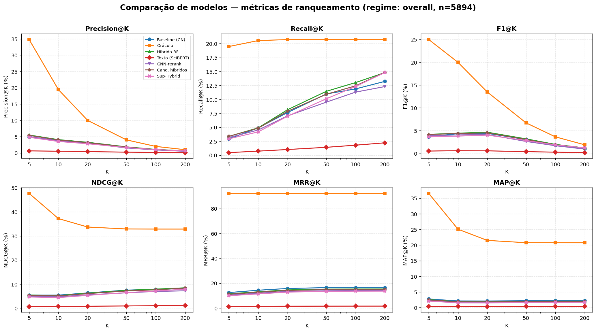
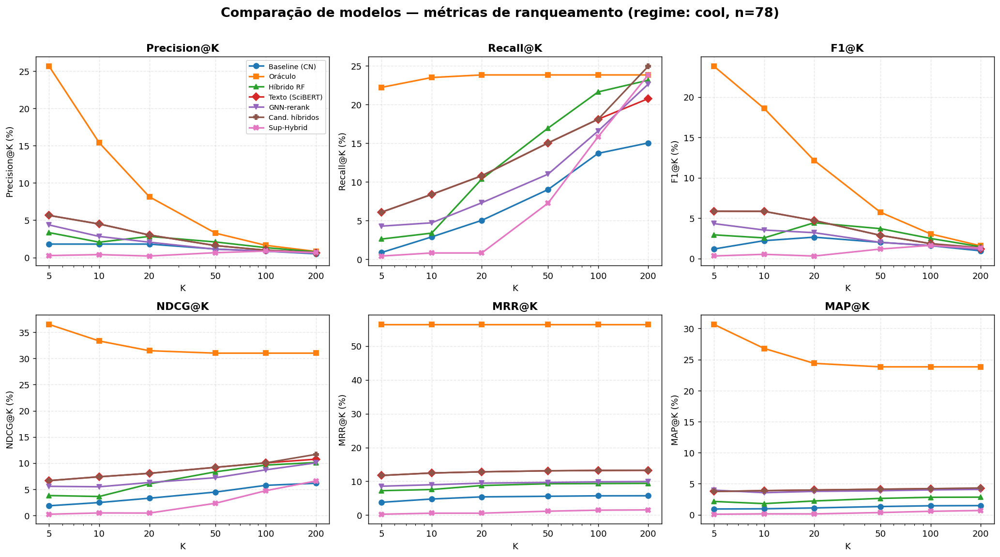

# Tabela de Métricas — Comparação Final (PYTHONHASHSEED=0)

Corpus T0: warm=976 · cool=78 · cold=3 · newcomer=4837 (total 5894).
Valores em %. K ∈ {5, 10, 20, 50, 100, 200}.

## Geral (todos os alvos)

### Precision@K
| Modelo | @5 | @10 | @20 | @50 | @100 | @200 |
|---|---|---|---|---|---|---|
| Baseline (CN) | 4.81 | 3.93 | 3.11 | 1.78 | 0.98 | 0.56 |
| Oráculo (teto) | 34.81 | 19.43 | 9.98 | 4.00 | 2.00 | 1.00 |
| Híbrido RF | 5.50 | 4.08 | 3.27 | 1.87 | 1.08 | 0.64 |
| Texto (SciBERT) | 0.63 | 0.53 | 0.41 | 0.24 | 0.16 | 0.10 |
| GNN-rerank | 5.06 | 3.71 | 2.96 | 1.53 | 0.92 | 0.50 |
| Cand. híbridos | 5.40 | 4.00 | 3.17 | 1.79 | 1.03 | 0.64 |
| Sup-Hybrid | 4.80 | 3.51 | 2.82 | 1.66 | 1.02 | 0.64 |

### Recall@K
| Modelo | @5 | @10 | @20 | @50 | @100 | @200 |
|---|---|---|---|---|---|---|
| Baseline (CN) | 2.93 | 4.90 | 7.64 | 10.97 | 11.88 | 13.23 |
| Oráculo (teto) | 19.47 | 20.54 | 20.72 | 20.73 | 20.73 | 20.73 |
| Híbrido RF | 3.38 | 4.90 | 8.15 | 11.44 | 13.01 | 14.80 |
| Texto (SciBERT) | 0.46 | 0.73 | 1.02 | 1.41 | 1.80 | 2.22 |
| GNN-rerank | 3.17 | 4.51 | 7.05 | 9.50 | 11.30 | 12.30 |
| Cand. híbridos | 3.38 | 4.84 | 7.86 | 10.91 | 12.43 | 14.84 |
| Sup-Hybrid | 2.94 | 4.18 | 6.99 | 10.10 | 12.31 | 14.81 |

### F1@K
| Modelo | @5 | @10 | @20 | @50 | @100 | @200 |
|---|---|---|---|---|---|---|
| Baseline (CN) | 3.64 | 4.36 | 4.42 | 3.06 | 1.81 | 1.08 |
| Oráculo (teto) | 24.98 | 19.97 | 13.47 | 6.71 | 3.65 | 1.91 |
| Híbrido RF | 4.19 | 4.45 | 4.67 | 3.21 | 2.00 | 1.22 |
| Texto (SciBERT) | 0.54 | 0.62 | 0.59 | 0.41 | 0.29 | 0.20 |
| GNN-rerank | 3.89 | 4.07 | 4.17 | 2.64 | 1.71 | 0.97 |
| Cand. híbridos | 4.16 | 4.38 | 4.52 | 3.07 | 1.91 | 1.23 |
| Sup-Hybrid | 3.64 | 3.82 | 4.02 | 2.86 | 1.89 | 1.22 |

### NDCG@K
| Modelo | @5 | @10 | @20 | @50 | @100 | @200 |
|---|---|---|---|---|---|---|
| Baseline (CN) | 5.43 | 5.43 | 6.35 | 7.51 | 7.81 | 8.20 |
| Oráculo (teto) | 47.69 | 37.23 | 33.71 | 32.91 | 32.87 | 32.87 |
| Híbrido RF | 5.48 | 5.23 | 6.25 | 7.42 | 7.93 | 8.47 |
| Texto (SciBERT) | 0.71 | 0.75 | 0.82 | 0.94 | 1.06 | 1.17 |
| GNN-rerank | 4.98 | 4.74 | 5.57 | 6.40 | 6.97 | 7.23 |
| Cand. híbridos | 5.34 | 5.11 | 6.07 | 7.16 | 7.65 | 8.36 |
| Sup-Hybrid | 4.67 | 4.41 | 5.33 | 6.47 | 7.17 | 7.89 |

### MRR@K
| Modelo | @5 | @10 | @20 | @50 | @100 | @200 |
|---|---|---|---|---|---|---|
| Baseline (CN) | 12.49 | 14.35 | 15.76 | 16.45 | 16.50 | 16.52 |
| Oráculo (teto) | 92.16 | 92.16 | 92.16 | 92.16 | 92.16 | 92.16 |
| Híbrido RF | 11.51 | 13.10 | 14.60 | 15.26 | 15.33 | 15.37 |
| Texto (SciBERT) | 1.29 | 1.45 | 1.53 | 1.57 | 1.60 | 1.60 |
| GNN-rerank | 10.42 | 11.95 | 13.43 | 13.91 | 14.04 | 14.06 |
| Cand. híbridos | 11.13 | 12.73 | 14.20 | 14.84 | 14.92 | 14.96 |
| Sup-Hybrid | 9.94 | 11.40 | 12.83 | 13.49 | 13.61 | 13.65 |

### MAP@K
| Modelo | @5 | @10 | @20 | @50 | @100 | @200 |
|---|---|---|---|---|---|---|
| Baseline (CN) | 2.75 | 2.12 | 2.10 | 2.19 | 2.22 | 2.24 |
| Oráculo (teto) | 36.55 | 25.08 | 21.50 | 20.76 | 20.74 | 20.73 |
| Híbrido RF | 2.55 | 1.90 | 1.88 | 1.99 | 2.03 | 2.06 |
| Texto (SciBERT) | 0.41 | 0.35 | 0.35 | 0.35 | 0.36 | 0.37 |
| GNN-rerank | 2.27 | 1.68 | 1.65 | 1.72 | 1.76 | 1.77 |
| Cand. híbridos | 2.47 | 1.84 | 1.83 | 1.92 | 1.96 | 2.00 |
| Sup-Hybrid | 2.08 | 1.51 | 1.50 | 1.60 | 1.66 | 1.70 |

## Warm (≥5 coautores em T0)

### Precision@K
| Modelo | @5 | @10 | @20 | @50 | @100 | @200 |
|---|---|---|---|---|---|---|
| Baseline (CN) | 3.26 | 2.49 | 1.95 | 1.13 | 0.76 | 0.47 |
| Oráculo (teto) | 27.97 | 16.50 | 8.61 | 3.44 | 1.72 | 0.86 |
| Híbrido RF | 4.20 | 3.56 | 2.86 | 1.77 | 1.14 | 0.65 |
| Texto (SciBERT) | 3.38 | 2.86 | 2.24 | 1.32 | 0.88 | 0.57 |
| GNN-rerank | 1.43 | 1.27 | 0.98 | 0.73 | 0.59 | 0.47 |
| Cand. híbridos | 3.42 | 2.86 | 2.25 | 1.32 | 0.88 | 0.70 |
| Sup-Hybrid | 0.23 | 0.25 | 0.39 | 0.64 | 0.83 | 0.68 |

### Recall@K
| Modelo | @5 | @10 | @20 | @50 | @100 | @200 |
|---|---|---|---|---|---|---|
| Baseline (CN) | 2.25 | 3.06 | 4.54 | 6.28 | 8.22 | 9.78 |
| Oráculo (teto) | 15.41 | 16.40 | 16.55 | 16.55 | 16.55 | 16.55 |
| Híbrido RF | 2.63 | 4.47 | 7.00 | 10.35 | 12.72 | 14.29 |
| Texto (SciBERT) | 2.32 | 3.74 | 5.29 | 7.33 | 9.39 | 11.73 |
| GNN-rerank | 1.21 | 1.76 | 2.54 | 4.28 | 6.55 | 10.54 |
| Cand. híbridos | 2.34 | 3.74 | 5.29 | 7.34 | 9.49 | 14.39 |
| Sup-Hybrid | 0.13 | 0.32 | 0.77 | 3.06 | 8.98 | 14.27 |

### F1@K
| Modelo | @5 | @10 | @20 | @50 | @100 | @200 |
|---|---|---|---|---|---|---|
| Baseline (CN) | 2.67 | 2.75 | 2.72 | 1.92 | 1.39 | 0.89 |
| Oráculo (teto) | 19.88 | 16.45 | 11.33 | 5.70 | 3.12 | 1.64 |
| Híbrido RF | 3.24 | 3.96 | 4.06 | 3.02 | 2.09 | 1.24 |
| Texto (SciBERT) | 2.75 | 3.24 | 3.15 | 2.24 | 1.61 | 1.09 |
| GNN-rerank | 1.31 | 1.48 | 1.42 | 1.24 | 1.09 | 0.90 |
| Cand. híbridos | 2.78 | 3.24 | 3.16 | 2.24 | 1.62 | 1.34 |
| Sup-Hybrid | 0.16 | 0.28 | 0.52 | 1.06 | 1.52 | 1.29 |

### NDCG@K
| Modelo | @5 | @10 | @20 | @50 | @100 | @200 |
|---|---|---|---|---|---|---|
| Baseline (CN) | 3.99 | 3.77 | 4.12 | 4.56 | 5.14 | 5.59 |
| Oráculo (teto) | 36.70 | 29.66 | 25.90 | 24.25 | 24.04 | 24.00 |
| Híbrido RF | 4.89 | 4.99 | 5.64 | 6.61 | 7.35 | 7.79 |
| Texto (SciBERT) | 3.77 | 3.95 | 4.33 | 4.93 | 5.57 | 6.23 |
| GNN-rerank | 1.69 | 1.82 | 2.01 | 2.59 | 3.31 | 4.35 |
| Cand. híbridos | 3.82 | 3.97 | 4.35 | 4.95 | 5.61 | 7.01 |
| Sup-Hybrid | 0.27 | 0.31 | 0.52 | 1.37 | 3.13 | 4.58 |

### MRR@K
| Modelo | @5 | @10 | @20 | @50 | @100 | @200 |
|---|---|---|---|---|---|---|
| Baseline (CN) | 7.80 | 8.55 | 9.06 | 9.28 | 9.35 | 9.39 |
| Oráculo (teto) | 58.61 | 58.61 | 58.61 | 58.61 | 58.61 | 58.61 |
| Híbrido RF | 9.53 | 10.45 | 11.06 | 11.36 | 11.45 | 11.52 |
| Texto (SciBERT) | 6.85 | 7.77 | 8.23 | 8.46 | 8.58 | 8.62 |
| GNN-rerank | 2.89 | 3.53 | 3.85 | 4.13 | 4.26 | 4.33 |
| Cand. híbridos | 6.92 | 7.83 | 8.31 | 8.54 | 8.65 | 8.74 |
| Sup-Hybrid | 0.66 | 0.77 | 1.04 | 1.38 | 1.70 | 1.80 |

### MAP@K
| Modelo | @5 | @10 | @20 | @50 | @100 | @200 |
|---|---|---|---|---|---|---|
| Baseline (CN) | 2.41 | 1.84 | 1.75 | 1.75 | 1.80 | 1.83 |
| Oráculo (teto) | 30.74 | 22.35 | 18.24 | 16.71 | 16.57 | 16.55 |
| Híbrido RF | 2.81 | 2.33 | 2.26 | 2.34 | 2.41 | 2.43 |
| Texto (SciBERT) | 2.17 | 1.82 | 1.77 | 1.80 | 1.86 | 1.89 |
| GNN-rerank | 0.99 | 0.86 | 0.83 | 0.87 | 0.92 | 0.98 |
| Cand. híbridos | 2.21 | 1.84 | 1.78 | 1.82 | 1.87 | 1.96 |
| Sup-Hybrid | 0.14 | 0.11 | 0.12 | 0.22 | 0.35 | 0.44 |

## Cool (1–4 coautores)

### Precision@K
| Modelo | @5 | @10 | @20 | @50 | @100 | @200 |
|---|---|---|---|---|---|---|
| Baseline (CN) | 1.79 | 1.79 | 1.79 | 1.13 | 0.85 | 0.49 |
| Oráculo (teto) | 25.64 | 15.38 | 8.14 | 3.26 | 1.63 | 0.81 |
| Híbrido RF | 3.33 | 2.05 | 2.82 | 2.08 | 1.32 | 0.76 |
| Texto (SciBERT) | 5.64 | 4.49 | 3.01 | 1.59 | 0.97 | 0.60 |
| GNN-rerank | 4.36 | 2.82 | 2.05 | 1.10 | 0.85 | 0.58 |
| Cand. híbridos | 5.64 | 4.49 | 3.01 | 1.59 | 0.97 | 0.69 |
| Sup-Hybrid | 0.26 | 0.38 | 0.19 | 0.64 | 0.86 | 0.66 |

### Recall@K
| Modelo | @5 | @10 | @20 | @50 | @100 | @200 |
|---|---|---|---|---|---|---|
| Baseline (CN) | 0.88 | 2.90 | 5.04 | 9.02 | 13.70 | 15.04 |
| Oráculo (teto) | 22.22 | 23.49 | 23.83 | 23.83 | 23.83 | 23.83 |
| Híbrido RF | 2.62 | 3.39 | 10.37 | 16.95 | 21.63 | 23.15 |
| Texto (SciBERT) | 6.10 | 8.39 | 10.80 | 15.04 | 18.10 | 20.77 |
| GNN-rerank | 4.29 | 4.72 | 7.31 | 11.00 | 16.59 | 22.65 |
| Cand. híbridos | 6.10 | 8.39 | 10.80 | 15.04 | 18.10 | 24.95 |
| Sup-Hybrid | 0.43 | 0.82 | 0.82 | 7.26 | 15.84 | 23.83 |

### F1@K
| Modelo | @5 | @10 | @20 | @50 | @100 | @200 |
|---|---|---|---|---|---|---|
| Baseline (CN) | 1.18 | 2.22 | 2.65 | 2.01 | 1.59 | 0.96 |
| Oráculo (teto) | 23.81 | 18.59 | 12.14 | 5.73 | 3.05 | 1.57 |
| Híbrido RF | 2.94 | 2.56 | 4.44 | 3.70 | 2.49 | 1.46 |
| Texto (SciBERT) | 5.86 | 5.85 | 4.71 | 2.88 | 1.85 | 1.16 |
| GNN-rerank | 4.33 | 3.53 | 3.20 | 2.00 | 1.61 | 1.13 |
| Cand. híbridos | 5.86 | 5.85 | 4.71 | 2.88 | 1.85 | 1.35 |
| Sup-Hybrid | 0.32 | 0.52 | 0.31 | 1.18 | 1.63 | 1.28 |

### NDCG@K
| Modelo | @5 | @10 | @20 | @50 | @100 | @200 |
|---|---|---|---|---|---|---|
| Baseline (CN) | 1.85 | 2.46 | 3.29 | 4.47 | 5.75 | 6.15 |
| Oráculo (teto) | 36.49 | 33.33 | 31.47 | 31.01 | 31.01 | 31.01 |
| Híbrido RF | 3.80 | 3.62 | 6.02 | 8.34 | 9.62 | 10.11 |
| Texto (SciBERT) | 6.65 | 7.39 | 8.04 | 9.19 | 10.04 | 10.75 |
| GNN-rerank | 5.56 | 5.47 | 6.29 | 7.21 | 8.71 | 10.04 |
| Cand. híbridos | 6.65 | 7.39 | 8.04 | 9.19 | 10.04 | 11.67 |
| Sup-Hybrid | 0.23 | 0.48 | 0.45 | 2.33 | 4.72 | 6.58 |

### MRR@K
| Modelo | @5 | @10 | @20 | @50 | @100 | @200 |
|---|---|---|---|---|---|---|
| Baseline (CN) | 3.78 | 4.76 | 5.39 | 5.57 | 5.70 | 5.71 |
| Oráculo (teto) | 56.41 | 56.41 | 56.41 | 56.41 | 56.41 | 56.41 |
| Híbrido RF | 7.22 | 7.57 | 8.74 | 9.27 | 9.33 | 9.38 |
| Texto (SciBERT) | 11.73 | 12.45 | 12.80 | 13.10 | 13.21 | 13.24 |
| GNN-rerank | 8.55 | 8.97 | 9.45 | 9.66 | 9.83 | 9.92 |
| Cand. híbridos | 11.73 | 12.45 | 12.80 | 13.11 | 13.21 | 13.27 |
| Sup-Hybrid | 0.26 | 0.56 | 0.56 | 1.15 | 1.46 | 1.53 |

### MAP@K
| Modelo | @5 | @10 | @20 | @50 | @100 | @200 |
|---|---|---|---|---|---|---|
| Baseline (CN) | 0.92 | 0.96 | 1.10 | 1.32 | 1.45 | 1.47 |
| Oráculo (teto) | 30.66 | 26.80 | 24.39 | 23.83 | 23.83 | 23.83 |
| Híbrido RF | 2.14 | 1.79 | 2.22 | 2.63 | 2.81 | 2.84 |
| Texto (SciBERT) | 3.75 | 3.88 | 3.98 | 4.12 | 4.20 | 4.24 |
| GNN-rerank | 3.96 | 3.55 | 3.77 | 3.87 | 4.01 | 4.08 |
| Cand. híbridos | 3.75 | 3.88 | 3.98 | 4.12 | 4.20 | 4.32 |
| Sup-Hybrid | 0.09 | 0.14 | 0.13 | 0.35 | 0.55 | 0.68 |

## Gráficos

- 
- 
